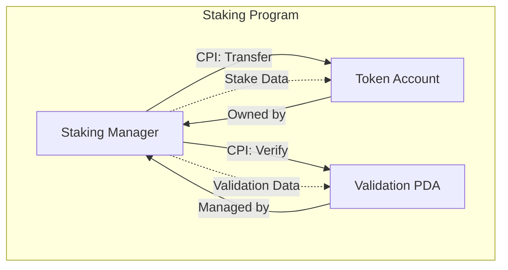

# Architecture Diagram Evaluation Checklist

## 1. Program Responsibilities (20 points)
- [ ] Clear separation of concerns between programs
- [ ] Each program's core functionality is well-defined
- [ ] Responsibilities are not duplicated across programs
- [ ] Program boundaries are clearly marked
- [ ] Program-specific PDAs are properly identified

## 2. Interactions and Accounts (25 points)
- [ ] All cross-program CPI calls are properly documented
- [ ] Data flow between accounts is clearly shown
- [ ] Account ownership relationships are visible
- [ ] Permission levels and access controls are indicated
- [ ] State transitions between accounts are properly represented

## 3. Account Structures (20 points)
- [ ] Different account types (PDA, Token, System) are visually distinct
- [ ] Account hierarchy is clearly shown
- [ ] Data structures within accounts are properly documented
- [ ] Account lifecycle is properly represented
- [ ] Storage requirements and limitations are indicated

## 4. External Integrations (15 points)
- [ ] All external dependencies are identified
- [ ] Integration points are clearly marked
- [ ] Data flow with external services is documented
- [ ] Error handling for external calls is shown
- [ ] Version compatibility is indicated

## 5. Overall Readability and Flow (20 points)
- [ ] Consistent visual hierarchy
- [ ] Logical grouping of related components
- [ ] Clear directional flow
- [ ] Appropriate use of colors and shapes
- [ ] Proper spacing and alignment

## Example Evaluation Rubric

### Program Responsibilities (20 points)
- 5 points: Clear program boundaries and responsibilities
- 5 points: Proper use of subgraphs to separate concerns
- 5 points: Consistent naming conventions
- 5 points: Documentation of program interfaces

### Interactions and Accounts (25 points)
- 10 points: Accurate representation of CPI calls
- 5 points: Clear data flow indicators
- 5 points: Proper account relationships
- 5 points: State transition documentation

### Account Structures (20 points)
- 5 points: Visual distinction between account types
- 5 points: Clear account hierarchy
- 5 points: Proper data structure representation
- 5 points: Lifecycle documentation

### External Integrations (15 points)
- 5 points: Complete dependency mapping
- 5 points: Clear integration points
- 5 points: Error handling documentation

### Overall Readability (20 points)
- 5 points: Visual clarity and organization
- 5 points: Consistent styling
- 5 points: Proper use of legends
- 5 points: Navigation and zoom features

## Example Evaluation Questions

### For Reviewers:
1. **Program Responsibilities**
   - Can you clearly identify each program's core functionality?
   - Are there any overlapping responsibilities?
   - Are program interfaces well-documented?

2. **Interactions**
   - Are all necessary CPI calls shown?
   - Is data flow between programs clear?
   - Are error paths properly documented?

3. **Account Structures**
   - Are different account types visually distinguishable?
   - Is the account hierarchy logical?
   - Are storage requirements clearly indicated?

4. **External Integrations**
   - Are all dependencies properly mapped?
   - Are integration points clearly marked?
   - Is version compatibility documented?

5. **Readability**
   - Is the diagram easy to navigate?
   - Are legends and keys comprehensive?
   - Is the visual hierarchy logical?

## Common Review Findings

### Positive Examples:


### Negative Examples:
```mermaid
graph TD
    %% Poor separation of concerns
    P1[All-In-One Program]:::program
    P1 --> P1
    P1 --> P1

    %% Unclear account relationships
    A1[Account]:::account
    A2[Account]:::account
    A1 --> A2  %% No clear ownership or relationship
```

## Review Checklist for Authors

### Before Submission:
- [ ] Have I clearly defined each program's responsibilities?
- [ ] Are all CPI calls properly documented?
- [ ] Are account relationships properly shown?
- [ ] Are external dependencies mapped?
- [ ] Is the diagram easy to read and navigate?

### During Review:
- [ ] Have I addressed all reviewer feedback?
- [ ] Are all changes properly documented?
- [ ] Have I updated legends and keys?
- [ ] Are all new components properly integrated?
- [ ] Have I maintained visual consistency?

## Final Review Checklist

### For Final Approval:
- [ ] All program responsibilities are clearly defined
- [ ] Interactions are properly documented
- [ ] Account structures are well-represented
- [ ] External integrations are complete
- [ ] Diagram is clear and readable
- [ ] All documentation is complete
- [ ] Legends and keys are comprehensive
- [ ] Version information is up-to-date
