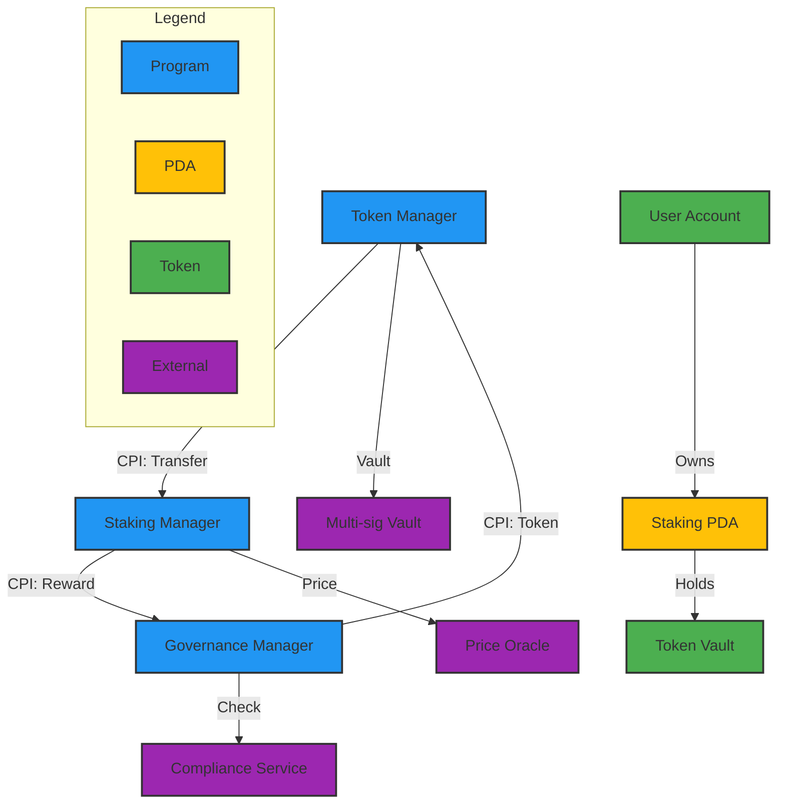

# Solana Protocol Architecture

## Key Components

### Programs
- Token Manager
- Staking Manager
- Governance Manager

### Account Structure
- User Account
- Staking PDA
- Token Vault

### External Services
- Price Oracle
- Compliance Service
- Multi-sig Vault
