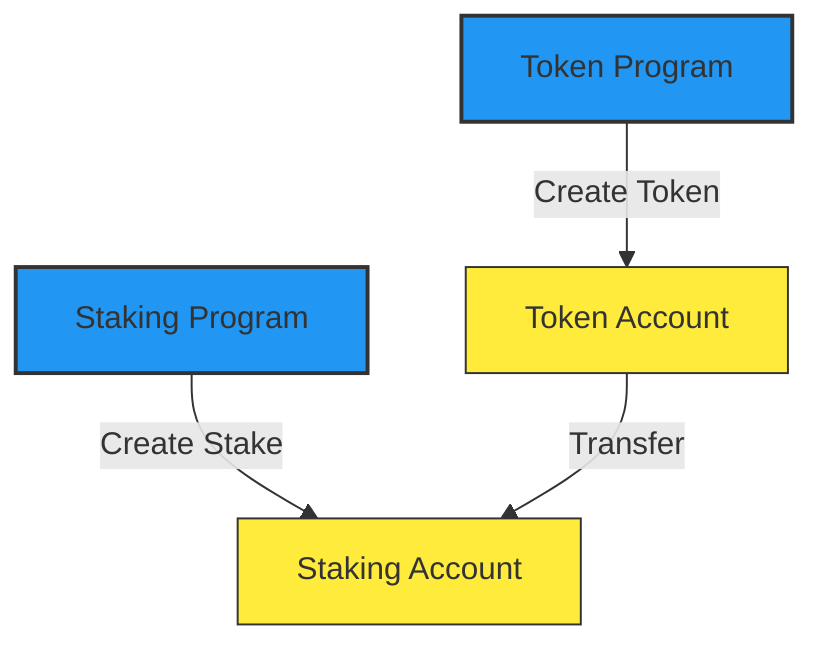
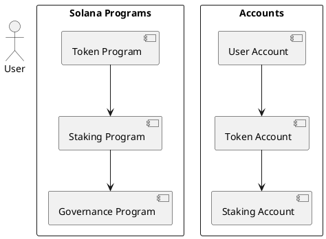

# Solana Protocol Diagramming Tools Comparison

## 1. Mermaid.js
**Pros:**
- **Text-based**: Easy to version control and modify
- **Markdown Integration**: Works well with documentation
- **Automatic Layout**: Handles complex diagrams
- **Real-time Rendering**: Instant updates
- **Free and Open Source**: No cost

**Cons:**
- **Limited Customization**: Less control over styling
- **Basic Shapes**: Limited to basic geometric shapes
- **No Drag-and-Drop**: Text-based editing only

**Best For Solana:**
- Quick documentation diagrams
- Simple program flow
- Basic account relationships
- Integration with Markdown

## 2. Draw.io (diagrams.net)
**Pros:**
- **Rich Library**: Many shapes and icons
- **Drag-and-Drop**: Easy to use interface
- **Export Options**: Multiple formats
- **Collaboration**: Real-time editing
- **Free**: Web-based version

**Cons:**
- **Learning Curve**: Takes time to learn
- **Manual Layout**: Requires manual positioning
- **Complexity**: Can be overwhelming

**Best For Solana:**
- Detailed program architecture
- Complex account relationships
- Multiple integration points
- Team collaboration

## 3. Lucidchart
**Pros:**
- **Professional**: Enterprise-grade features
- **Templates**: Pre-built diagrams
- **Integration**: Teams and Confluence
- **Advanced Features**: Layers, version history
- **Customization**: Rich styling

**Cons:**
- **Cost**: Paid service
- **Complex**: Feature-rich interface
- **Local Storage**: Requires account

**Best For Solana:**
- Enterprise-level documentation
- Professional presentations
- Complex system architecture
- Team collaboration

## 4. Figma
**Pros:**
- **Design-Focused**: Great for UI/UX
- **Collaboration**: Real-time editing
- **Prototyping**: Interactive designs
- **Components**: Reusable elements
- **Community**: Rich library of assets

**Cons:**
- **Cost**: Paid service
- **Learning Curve**: Design-focused
- **Export**: Limited diagram formats

**Best For Solana:**
- Frontend integration
- UI/UX flows
- Interactive prototypes
- Design systems

## 5. PlantUML
**Pros:**
- **Text-based**: Version control friendly
- **Multiple Formats**: Sequence, class, activity diagrams
- **Integration**: Many IDEs
- **Open Source**: Free
- **Documentation**: Extensive examples

**Cons:**
- **Syntax**: Steep learning curve
- **Limited GUI**: No visual editor
- **Rendering**: Requires setup

**Best For Solana:**
- Sequence diagrams
- Class relationships
- Technical documentation
- Integration with IDEs

## Solana-Specific Considerations

### Program Modularity
- Use distinct containers for each program
- Show clear input/output boundaries
- Highlight program-to-program interactions
- Use different colors for different programs

### Separation of Concerns
- Separate on-chain/off-chain components
- Show clear data boundaries
- Highlight program responsibilities
- Use layers for different concerns

### Token and Account Interactions
- Use consistent shapes for different account types
- Show clear token flow paths
- Highlight PDA relationships
- Use different colors for different token types

### Best Practices
1. **Consistent Styling**:
   - Programs: Blue containers
   - Accounts: Yellow containers
   - PDAs: Pink containers with dashed borders
   - External services: Gray clouds

2. **Clear Labels**:
   - Use concise, descriptive labels
   - Include timestamps where relevant
   - Show data types in flows
   - Label all connections

3. **Hierarchy**:
   - Show parent-child relationships clearly
   - Use consistent layout patterns
   - Group related components
   - Show authority relationships

4. **Integration Points**:
   - Use special symbols for external services
   - Show clear data boundaries
   - Highlight cross-program interactions
   - Include error paths

## Tool Selection Guide

| Use Case | Recommended Tool |
|----------|------------------|
| Quick Documentation | Mermaid.js |
| Team Collaboration | Draw.io |
| Enterprise Documentation | Lucidchart |
| UI/UX Design | Figma |
| Technical Documentation | PlantUML |
| Complex Architecture | Draw.io or Lucidchart |
| Simple Flowcharts | Mermaid.js |
| Prototypes | Figma |
| Sequence Diagrams | PlantUML |

## Implementation Tips

1. **Start Simple**:
   - Begin with basic shapes
   - Add complexity gradually
   - Focus on core relationships first

2. **Version Control**:
   - Keep diagrams in source control
   - Use descriptive commit messages
   - Maintain changelog

3. **Documentation**:
   - Include legends
   - Add descriptions
   - Document assumptions
   - Include references

4. **Validation**:
   - Review with team
   - Check for consistency
   - Validate against code
   - Update regularly

5. **Maintenance**:
   - Keep diagrams up to date
   - Archive old versions
   - Document changes
   - Maintain style guide
