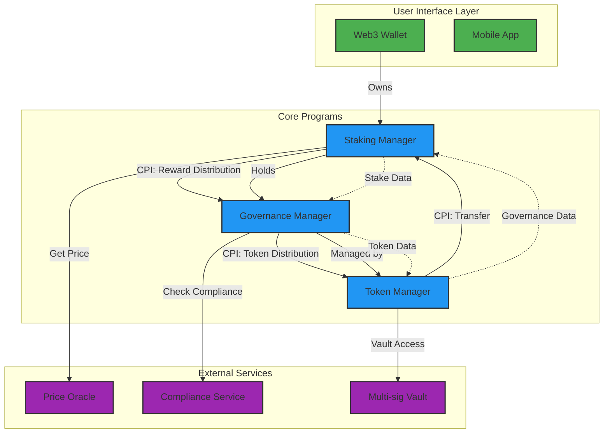
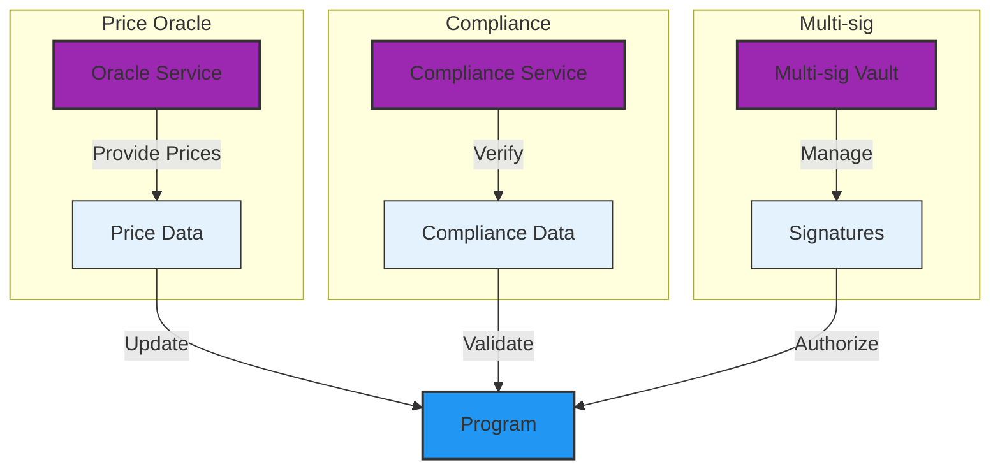
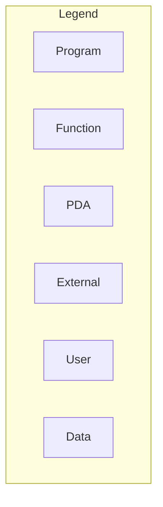

# Solana Protocol Architecture Diagrams

## 1. Architecture Overview


## 2. Account Structure
```mermaid
graph TD
    %% Style Definitions
classDef program fill:#2196F3,stroke:#333,stroke-width:2px
classDef pda fill:#FFC107,stroke:#333,stroke-width:2px
classDef token fill:#2196F3,stroke:#333,stroke-width:2px
classDef system fill:#9C27B0,stroke:#333,stroke-width:2px
classDef data fill:#E3F2FD,stroke:#333,stroke-width:1px

    %% Account Hierarchy
    subgraph "User Accounts"
        U1[User Wallet]:::user
        U2[Staking Account]:::user
        U3[Token Account]:::user
    end

    subgraph "Program Derived Addresses"
        P1[Staking PDA]:::pda
        P2[Rewards PDA]:::pda
        P3[Validator PDA]:::pda
    end

    %% Account Relationships
    U1 -->|"Owns"| U2
    U2 -->|"Holds"| P1
    P1 -->|"Holds"| T1
    T1 -->|"Managed by"| S1

    %% Data Structure Layout
    P1 -->|{"stake_amount": u64
            "activation_time": i64
            "last_update": i64
            "status": u8}:::data| P2

    %% Account Lifecycle
    subgraph "Lifecycle"
        L1[Created]:::process
        L2[Active]:::process
        L3[Locked]:::process
        L4[Closed]:::process
        L1 --> L2
        L2 --> L3
        L3 --> L4
    end
```

## 3. Staking Flow

```mermaid
graph TD
    %% Style Definitions
classDef program fill:#2196F3,stroke:#333,stroke-width:2px
classDef function fill:#E3F2FD,stroke:#333,stroke-width:1px
classDef pda fill:#FFC107,stroke:#333,stroke-width:2px
classDef external fill:#9C27B0,stroke:#333,stroke-width:2px
classDef user fill:#4CAF50,stroke:#333,stroke-width:2px
classDef data fill:#E3F2FD,stroke:#333,stroke-width:1px

    %% Main Flow
    subgraph "Staking Process"
        SP[Staking Program]:::program
        SP -->|"User Deposits"| D1{Check User Status}:::decision

        D1 -->|"New User"| P1[Create New Account]:::process
        D1 -->|"Existing User"| P2[Verify Account]:::process

        P1 --> A1[User Staking Account]:::pda
        P2 --> A1

        A1 -->|"Deposit"| D2{Check Balance}:::decision
        D2 -->|"Insufficient"| P3[Request More SOL]:::process
        D2 -->|"Sufficient"| P4[Create Stake Entry]:::process

        P4 --> P5[Create Staking PDA]:::process
        P5 --> PDA1[Staking PDA]:::pda

        PDA1 -->|"Get Price"| E1[Price Oracle]:::external
        E1 --> PDA1

        PDA1 -->|"Calculate Rewards"| D3{Check Rewards}:::decision
        D3 -->|"No Rewards"| P6[Wait for Next Epoch]:::process
        D3 -->|"Has Rewards"| P7[Distribute Rewards]:::process
    end
```


## 4. External Integrations


## 5. Diagram Legends

