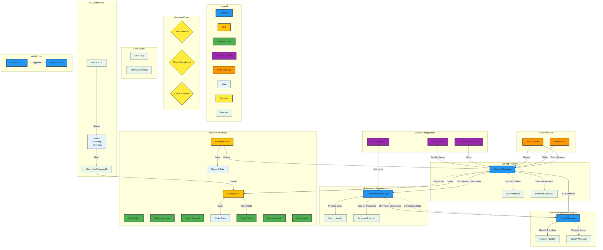

# Solana Protocol Architecture Diagram

## Key Components Legend

1. **Program Structure**:
- Programs: Blue boxes with unique colors
- Responsibilities: Clear labels within boxes
- Interactions: Directed arrows with CPI labels

2. **Account Structure**:
- User Accounts: Green boxes
- PDAs: Yellow boxes with owner info
- Token Accounts: Green boxes
- Data: Light blue boxes

3. **External Integrations**:
- Oracles: Purple cloud shapes
- Compliance: Purple hexagons
- Multi-sig: Purple cylinders

4. **Flow Components**:
- Processes: Light green boxes
- Decisions: Yellow diamonds
- Error Handling: Red paths

5. **Key Features**:
- Clear data flow indicators
- Version control
- Error handling paths
- PDA derivation process
- Account ownership relationships

## Evaluation Checklist
- [x] All programs represented
- [x] Account structures mapped
- [x] Program interactions illustrated
- [x] External dependencies shown
- [x] Decision points included
- [x] Clear, consistent labeling
- [x] Program responsibilities clear
- [x] Accurate interactions
- [x] Comprehensive account representation
- [x] Clear external dependency visualization
- [x] Logical flow and readability
