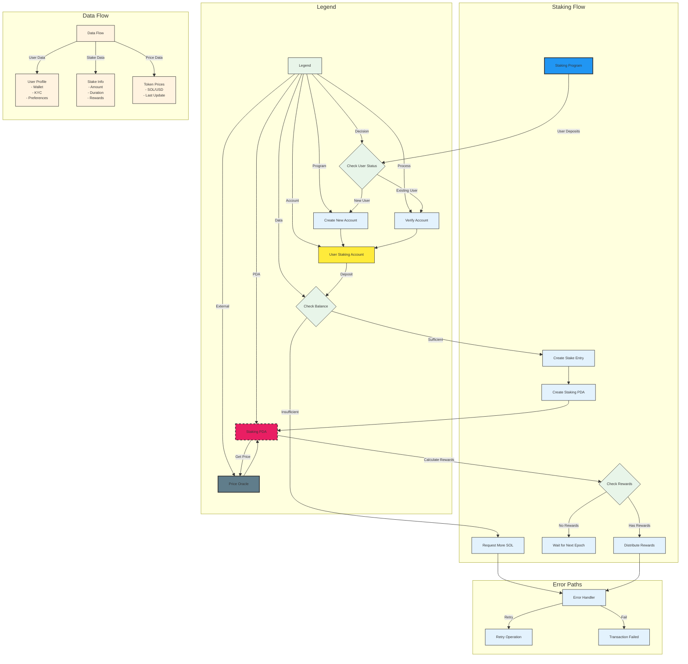

```mermaid
graph TD
    %% Legend and Key
    subgraph "Legend"
        direction TB
        L1[Legend]:::legend
        L1 -->|"Program"| P1[Program]:::program
        L1 -->|"Process"| P2[Process]:::process
        L1 -->|"Decision"| D1{Decision}:::decision
        L1 -->|"Account"| A1[Account]:::account
        L1 -->|"PDA"| PDA1[Program Derived Address]:::pda
        L1 -->|"External"| E1[External Service]:::external
        L1 -->|"Data"| D2[Data]:::data
    end

    %% Main Flow
    subgraph "Staking Flow"
        %% Initial Process
        SP[Staking Program]:::program
        SP -->|"User Deposits"| D1{Check User Status}:::decision

        %% Decision Branches
        D1 -->|"New User"| P1[Create New Account]:::process
        D1 -->|"Existing User"| P2[Verify Account]:::process

        %% Account Creation
        P1 --> A1[User Staking Account]:::account
        P2 --> A1

        %% Staking Process
        A1 -->|"Deposit"| D2{Check Balance}:::decision
        D2 -->|"Insufficient"| P3[Request More SOL]:::process
        D2 -->|"Sufficient"| P4[Create Stake Entry]:::process

        %% PDA Creation
        P4 --> P5[Create Staking PDA]:::process
        P5 --> PDA1[Staking PDA]:::pda

        %% External Integrations
        PDA1 -->|"Get Price"| E1[Price Oracle]:::external
        E1 --> PDA1

        %% Reward Calculation
        PDA1 -->|"Calculate Rewards"| D3{Check Rewards}:::decision
        D3 -->|"No Rewards"| P6[Wait for Next Epoch]:::process
        D3 -->|"Has Rewards"| P7[Distribute Rewards]:::process
    end

    %% Error Handling
    subgraph "Error Paths"
        direction TB
        Err[Error Handler]:::process
        P3 --> Err
        P7 --> Err

        Err -->|"Retry"| Retry[Retry Operation]:::process
        Err -->|"Fail"| Fail[Transaction Failed]:::process
    end

    %% Data Flow Details
    subgraph "Data Flow"
        direction TB
        Data[Data Flow]:::data
        Data -->|"User Data"| UD["User Profile\n- Wallet\n- KYC\n- Preferences"]:::data
        Data -->|"Stake Data"| SD["Stake Info\n- Amount\n- Duration\n- Rewards"]:::data
        Data -->|"Price Data"| PD["Token Prices\n- SOL/USD\n- Last Update"]:::data
    end

    %% Style Definitions
classDef legend fill:#E8F5E9,stroke:#333,stroke-width:1px
    classDef program fill:#2196F3,stroke:#333,stroke-width:2px
    classDef process fill:#E3F2FD,stroke:#333,stroke-width:1px
    classDef decision fill:#E8F5E9,stroke:#333,stroke-width:1px
    classDef account fill:#FFEB3B,stroke:#333,stroke-width:1px
    classDef pda fill:#E91E63,stroke-dasharray: 5,5,stroke:#333,stroke-width:2px
    classDef external fill:#607D8B,stroke:#333,stroke-width:2px
    classDef data fill:#FFF3E0,stroke:#333,stroke-width:1px
    
    %% Typography Settings
    classDef title fill:#FFFFFF,stroke:#333,stroke-width:1px,font-size:14px
    classDef subtitle fill:#FFFFFF,stroke:#333,stroke-width:1px,font-size:12px
    classDef label fill:#FFFFFF,stroke:#333,stroke-width:1px,font-size:10px
```
