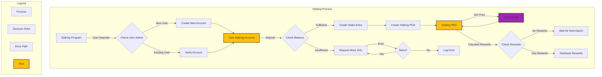

```mermaid
graph TD
    %% Style Definitions
classDef program fill:#2196F3,stroke:#333,stroke-width:2px
classDef function fill:#E3F2FD,stroke:#333,stroke-width:1px
classDef pda fill:#FFC107,stroke:#333,stroke-width:2px
classDef external fill:#9C27B0,stroke:#333,stroke-width:2px
    classDef user fill:#4CAF50,stroke:#333,stroke-width:2px
classDef data fill:#E3F2FD,stroke:#333,stroke-width:1px

    %% Main Flow
    subgraph "Staking Process"
        %% Initial Process
        SP[Staking Program]:::process
        SP -->|"User Deposits"| D1{Check User Status}:::decision

        %% Decision Branches
        D1 -->|"New User"| P1[Create New Account]:::process
        D1 -->|"Existing User"| P2[Verify Account]:::process

        %% Account Creation
        P1 --> A1[User Staking Account]:::pda
        P2 --> A1

        %% Staking Process
        A1 -->|"Deposit"| D2{Check Balance}:::decision
        D2 -->|"Insufficient"| P3[Request More SOL]:::process
        D2 -->|"Sufficient"| P4[Create Stake Entry]:::process

        %% PDA Creation
        P4 --> P5[Create Staking PDA]:::process
        P5 --> PDA1[Staking PDA]:::pda

        %% External Integrations
        PDA1 -->|"Get Price"| E1[Price Oracle]:::external
        E1 --> PDA1

        %% Reward Calculation
        PDA1 -->|"Calculate Rewards"| D3{Check Rewards}:::decision
        D3 -->|"No Rewards"| P6[Wait for Next Epoch]:::process
        D3 -->|"Has Rewards"| P7[Distribute Rewards]:::process

        %% Error Handling
        P3 -->|"Error"| E2{Retry?}:::decision
        E2 -->|"Yes"| P3
        E2 -->|"No"| E3[Log Error]:::error
    end

    %% Legend
    subgraph "Legend"
        L1[Process]:::process
        L2[Decision Point]:::decision
        L3[Error Path]:::error
        L4[PDA]:::pda
    end
```
