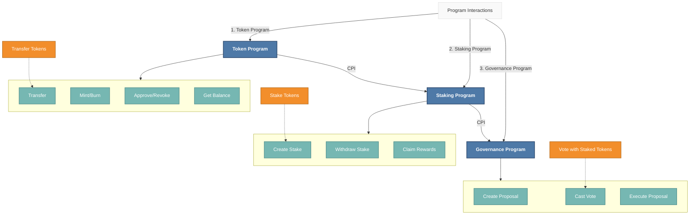
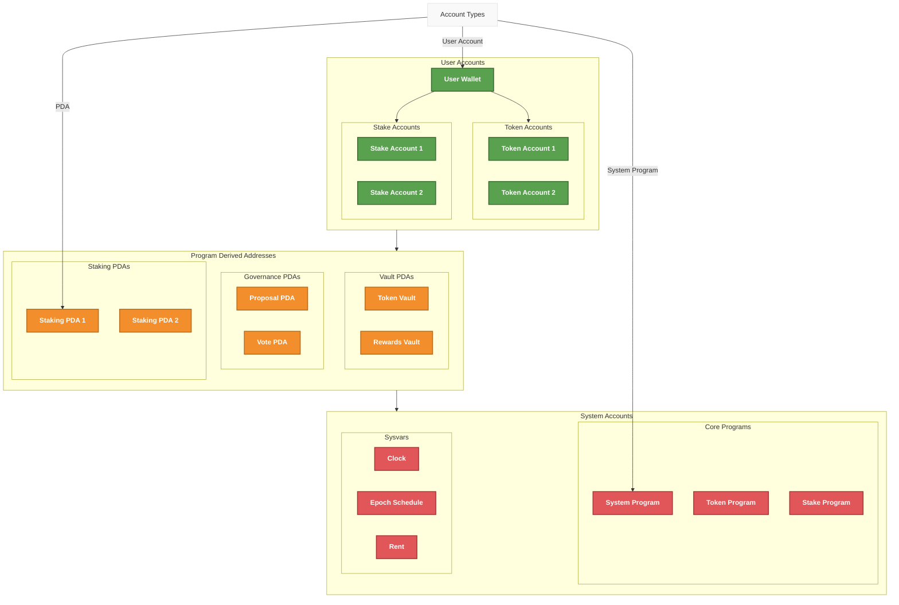

# Solana Protocol Architecture

This document outlines the comprehensive architecture of the Solana protocol implementation, following the Solana Protocol Architecture guidelines. The architecture is broken down into three main components, each with its own detailed diagram.

## 1. Program Structure



### Key Components:
- **Token Program**: Handles token transfers, minting, and balance management
- **Staking Program**: Manages staking operations and reward calculations
- **Governance Program**: Handles proposal creation, voting, and execution

## 2. Account Structure



### Account Types:
- **User Accounts**: Owned by users, contain SOL and token balances
- **Program Derived Addresses (PDAs)**: Stateless accounts managed by programs
- **System Accounts**: Core Solana system accounts and programs

## 3. External Integrations

```mermaid
%% External Integrations Diagram
flowchart TD
    %% Styling
    classDef external fill:#B07AA1,stroke:#7D5772,color:white,stroke-width:2px,font-weight:bold
    classDef oracle fill:#4E79A7,stroke:#2E4A6E,color:white,stroke-width:2px,font-weight:bold
    classDef compliance fill:#E15759,stroke:#A73638,color:white,stroke-width:2px,font-weight:bold
    classDef multisig fill:#F28E2B,stroke:#B66D1F,color:white,stroke-width:2px,font-weight:bold
    classDef program fill:#59A14F,stroke:#3A6B33,color:white,stroke-width:2px,font-weight:bold
    
    %% Core Programs
    subgraph Programs[Core Programs]
        direction TB
        TP[Token Program]
        SP[Staking Program]
        GP[Governance Program]
    end
    
    %% Oracle Integration
    subgraph Oracle[Price Oracle]
        direction TB
        O1[Price Feed API]
        O2[Data Verification]
        O3[On-chain Update]
        
        O1 -->|Fetch| O2
        O2 -->|Verify| O3
    end
    
    %% Compliance Service
    subgraph Compliance[Compliance Service]
        direction TB
        C1[KYC/AML Check]
        C2[Sanctions Screening]
        C3[Risk Analysis]
        
        C1 --> C2
        C2 --> C3
    end
    
    %% Multi-sig Vault
    subgraph MultiSig[Multi-sig Vault]
        direction TB
        M1[Propose Transaction]
        M2[Approve (n/m)]
        M3[Execute]
        
        M1 --> M2
        M2 --> M3
    end
    
    %% Integration Points
    TP <-->|1. Price Data| Oracle
    TP <-->|2. Compliance Check| Compliance
    TP <-->|3. Multi-sig Control| MultiSig
    
    SP <-->|4. Oracle Data| Oracle
    GP <-->|5. Multi-sig| MultiSig
    
    %% Styling
    class TP,SP,GP program
    class O1,O2,O3 oracle
    class C1,C2,C3 compliance
    class M1,M2,M3 multisig
    
    %% Legend
    legend[Integration Points]
    legend -->|1. Token Pricing| Oracle
    legend -->|2. Regulatory Compliance| Compliance
    legend -->|3. Secure Transfers| MultiSig
    
    style legend fill:#f9f9f9,stroke:#ddd,stroke-width:1px
```

### Integration Points:
- **Price Oracle**: Provides real-time price feeds for assets
- **Compliance Service**: Handles KYC/AML and regulatory requirements
- **Multi-sig Vault**: Enables secure, multi-signature transactions

## Flow Components

### Staking Flow
1. User deposits tokens into staking account
2. Staking program creates stake account
3. Rewards accrue based on staking duration
4. User can claim rewards or unstake tokens

### Governance Flow
1. Token holders create proposals
2. Voting period begins
3. Votes are tallied on-chain
4. Successful proposals are executed

## Security Considerations
- All programs implement proper access control
- Critical operations require proper authorization
- External calls are validated and rate-limited
- Comprehensive test coverage for all programs
