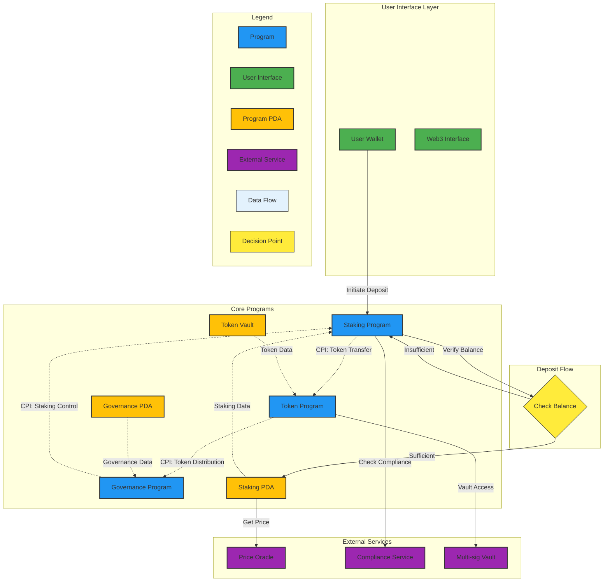

```mermaid
graph TD
    %% Style Definitions
classDef program fill:#2196F3,stroke:#333,stroke-width:2px
classDef user fill:#4CAF50,stroke:#333,stroke-width:2px
classDef pda fill:#FFC107,stroke:#333,stroke-width:2px
classDef external fill:#9C27B0,stroke:#333,stroke-width:2px
classDef data fill:#E3F2FD,stroke:#333,stroke-width:1px
classDef decision fill:#FFEB3B,stroke:#333,stroke-width:1px

    %% Main Architecture Layout
    subgraph "User Interface Layer"
        U1[User Wallet]:::user
        U2[Web3 Interface]:::user
    end

    subgraph "Core Programs"
        %% Program Components
        P1[Staking Program]:::program
        P2[Token Program]:::program
        P3[Governance Program]:::program
        
        %% Program PDAs
        PDA1[Staking PDA]:::pda
        PDA2[Token Vault]:::pda
        PDA3[Governance PDA]:::pda
    end

    subgraph "External Services"
        O1[Price Oracle]:::external
        C1[Compliance Service]:::external
        M1[Multi-sig Vault]:::external
    end

    %% User Interaction Flow
    subgraph "Deposit Flow"
        U1 -->|"Initiate Deposit"| P1
        P1 -->|"Verify Balance"| D1{Check Balance}:::decision
        D1 -->|"Insufficient"| P1
        D1 -->|"Sufficient"| PDA1
    end

    %% Program Interaction Matrix
    P1 -.->|"CPI: Token Transfer"| P2
    P2 -.->|"CPI: Token Distribution"| P3
    P3 -.->|"CPI: Staking Control"| P1

    %% Data Flow
    PDA1 -.->|"Staking Data"| P1
    PDA2 -.->|"Token Data"| P2
    PDA3 -.->|"Governance Data"| P3

    %% External Integrations
    PDA1 -->|"Get Price"| O1
    P1 -->|"Check Compliance"| C1
    P2 -->|"Vault Access"| M1

    %% Legend
    subgraph "Legend"
        L1[Program]:::program
        L2[User Interface]:::user
        L3[Program PDA]:::pda
        L4[External Service]:::external
        L5[Data Flow]:::data
        L6[Decision Point]:::decision
    end
```
