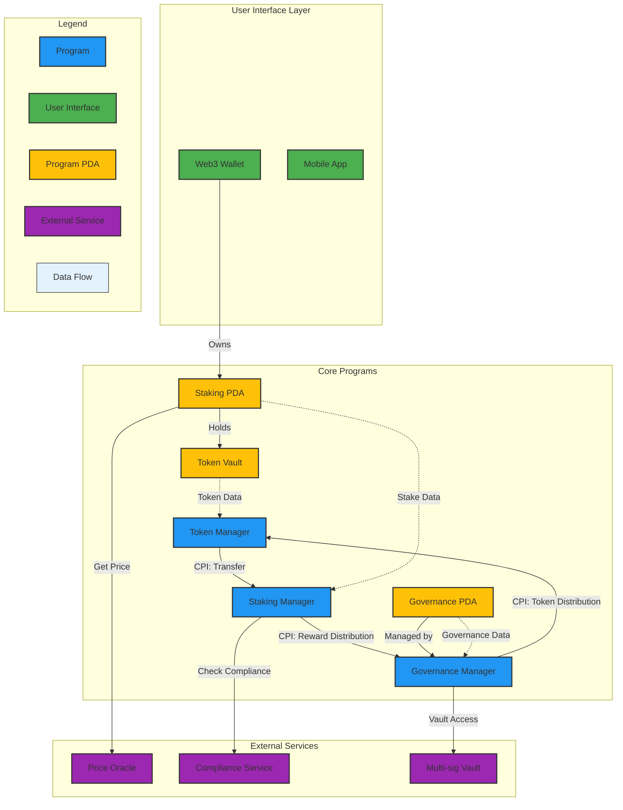

```mermaid
graph TD
    %% Style Definitions
classDef program fill:#2196F3,stroke:#333,stroke-width:2px
classDef function fill:#E3F2FD,stroke:#333,stroke-width:1px
classDef pda fill:#FFC107,stroke:#333,stroke-width:2px
classDef external fill:#9C27B0,stroke:#333,stroke-width:2px
classDef user fill:#4CAF50,stroke:#333,stroke-width:2px
classDef data fill:#E3F2FD,stroke:#333,stroke-width:1px

    %% Main Architecture Layout
    subgraph "User Interface Layer"
        U1[Web3 Wallet]:::user
        U2[Mobile App]:::user
    end

    subgraph "Core Programs"
        %% Program Components
        P1[Token Manager]:::program
        P2[Staking Manager]:::program
        P3[Governance Manager]:::program
        
        %% Program PDAs
        PDA1[Staking PDA]:::pda
        PDA2[Token Vault]:::pda
        PDA3[Governance PDA]:::pda
    end

    subgraph "External Services"
        O1[Price Oracle]:::external
        C1[Compliance Service]:::external
        M1[Multi-sig Vault]:::external
    end

    %% Program Interactions
    P1 -->|"CPI: Transfer"| P2
    P2 -->|"CPI: Reward Distribution"| P3
    P3 -->|"CPI: Token Distribution"| P1

    %% Account Relationships
    U1 -->|"Owns"| PDA1
    PDA1 -->|"Holds"| PDA2
    PDA3 -->|"Managed by"| P3

    %% External Integrations
    PDA1 -->|"Get Price"| O1
    P2 -->|"Check Compliance"| C1
    P3 -->|"Vault Access"| M1

    %% Data Flow
    PDA1 -.->|"Stake Data"| P2
    PDA2 -.->|"Token Data"| P1
    PDA3 -.->|"Governance Data"| P3

    %% Legend
    subgraph "Legend"
        L1[Program]:::program
        L2[User Interface]:::user
        L3[Program PDA]:::pda
        L4[External Service]:::external
        L5[Data Flow]:::data
    end
```
