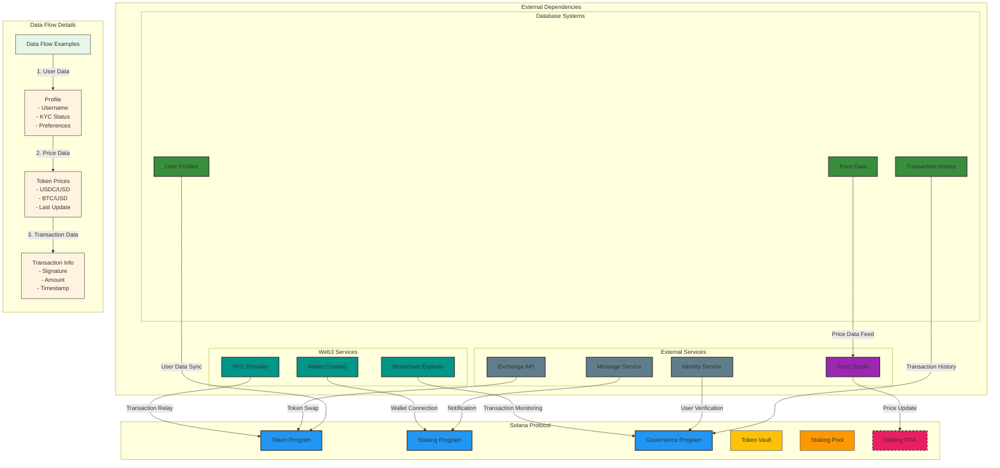

```mermaid
graph TB
    subgraph "Solana Protocol"
        %% Core Programs
        TP[Token Program]:::program
        SP[Staking Program]:::program
        GP[Governance Program]:::program
        
        %% Key Accounts
        T1[Token Vault]:::token_account
        S1[Staking Pool]:::staking_account
        PDA1[Staking PDA]:::pda
    end

    %% External Systems
    subgraph "External Dependencies"
        %% Databases
        subgraph "Database Systems"
            DB1[User Profiles]:::database
            DB2[Transaction History]:::database
            DB3[Price Data]:::database
        end

        %% External Services
        subgraph "External Services"
            EX[Exchange API]:::external_service
            OR[Price Oracle]:::oracle
            ID[Identity Service]:::external_service
            MS[Message Service]:::external_service
        end

        %% Web3 Integrations
        subgraph "Web3 Services"
            WC[Wallet Connect]:::web3
            RPC[RPC Provider]:::web3
            BR[Blockchain Explorer]:::web3
        end
    end

    %% Integration Points
    %% Database Integrations
    DB1 -->|"User Data Sync"| TP
    DB2 -->|"Transaction History"| GP
    DB3 -->|"Price Data Feed"| OR

    %% Service Integrations
    EX -->|"Token Swap"| TP
    OR -->|"Price Update"| PDA1
    ID -->|"User Verification"| GP
    MS -->|"Notification"| SP

    %% Web3 Integrations
    WC -->|"Wallet Connection"| SP
    RPC -->|"Transaction Relay"| TP
    BR -->|"Transaction Monitoring"| GP

    %% Data Flow Details
    subgraph "Data Flow Details"
        direction TB
        DataFlow["Data Flow Examples"]:::process
        
        DataFlow -->|"1. User Data"| UserData["Profile\n- Username\n- KYC Status\n- Preferences"]:::data
        UserData -->|"2. Price Data"| PriceData["Token Prices\n- USDC/USD\n- BTC/USD\n- Last Update"]:::data
        PriceData -->|"3. Transaction Data"| TxData["Transaction Info\n- Signature\n- Amount\n- Timestamp"]:::data
    end

    %% Style Definitions
classDef program fill:#2196F3,stroke:#333,stroke-width:2px
    classDef token_account fill:#FFC107,stroke:#333,stroke-width:1px
    classDef staking_account fill:#FF9800,stroke:#333,stroke-width:1px
    classDef pda fill:#E91E63,stroke-dasharray: 5,5,stroke:#333,stroke-width:2px
    
    classDef database fill:#388E3C,stroke:#333,stroke-width:2px,shape:cylinder
    classDef external_service fill:#607D8B,stroke:#333,stroke-width:2px,shape:cloud
    classDef oracle fill:#9C27B0,stroke:#333,stroke-width:2px,shape:hexagon
    classDef web3 fill:#009688,stroke:#333,stroke-width:2px,shape:cloud
    
    classDef process fill:#E8F5E9,stroke:#333,stroke-width:1px
    classDef data fill:#FFF3E0,stroke:#333,stroke-width:1px
```
