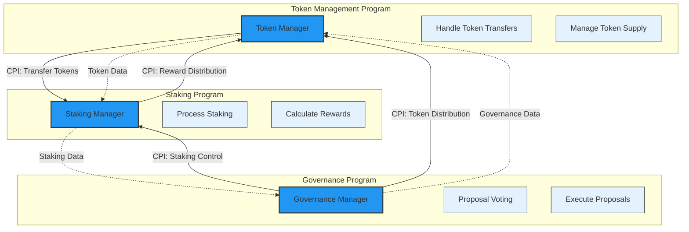

```mermaid
graph TD
    subgraph "Token Management Program"
        A[Token Manager]:::program
        A1[Handle Token Transfers]:::function
        A2[Manage Token Supply]:::function
    end

    subgraph "Staking Program"
        B[Staking Manager]:::program
        B1[Process Staking]:::function
        B2[Calculate Rewards]:::function
    end

    subgraph "Governance Program"
        C[Governance Manager]:::program
        C1[Proposal Voting]:::function
        C2[Execute Proposals]:::function
    end

    %% Program Interactions
    A -->|"CPI: Transfer Tokens"| B
    B -->|"CPI: Reward Distribution"| A
    C -->|"CPI: Token Distribution"| A
    C -->|"CPI: Staking Control"| B

    %% Data Flow
    A -.->|"Token Data"| B
    B -.->|"Staking Data"| C
    C -.->|"Governance Data"| A

    %% Style definitions
classDef program fill:#2196F3,stroke:#333,stroke-width:2px
    classDef function fill:#E3F2FD,stroke:#333,stroke-width:1px
    classDef data fill:#FFF3E0,stroke:#333,stroke-width:1px
    classDef control fill:#E8F5E9,stroke:#333,stroke-width:1px
```
